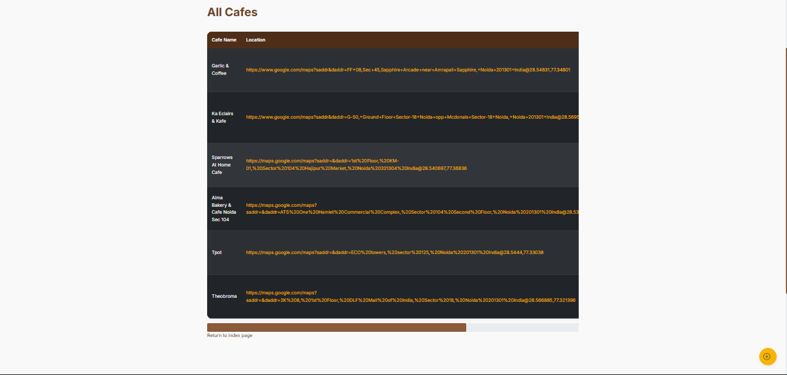

# ☕ Coffee Tracker Flask App — Documentation

## 📋 Overview
**Coffee Tracker** is a simple Flask web application that allows users to:
- Add new cafes along with important information like location, open/close times, and ratings.
- View a list of all added cafes in a nicely styled table.
- Manage cafe data stored in a CSV file (`cafe-data.csv`).

The app uses:
- **Flask** — lightweight backend framework.
- **Flask-Bootstrap5** — for styling with Bootstrap 5.
- **Flask-WTF** — for secure, validated forms.
- **CSV** — as a simple backend storage (no database needed for now).

---

## 🛠 Setup Instructions

### 1. Clone the repository
```bash
git clone https://github.com/YuvrajJais9257/coffee_tracker_flask.git
cd coffee_tracker_flask
```

### 2. Install dependencies
```bash
pip install -r requirements.txt
```
or on Mac/Linux:
```bash
pip3 install -r requirements.txt
```

**Main libraries:**
- `Flask`
- `Flask-Bootstrap`
- `Flask-WTF`
- `WTForms`

---

## 🚀 Running the Application
```bash
python app.py
```
or
```bash
python3 app.py
```
Then open your browser and go to:  
📍 `http://127.0.0.1:5000/`

---

## 📄 Application Structure

| File/Folder       | Description |
|:------------------|:------------|
| `app.py`           | Main Flask application file (routes, forms, logic). |
| `templates/`       | HTML templates (Jinja2) for rendering web pages. |
| `static/` (optional) | Static assets like CSS (if used). |
| `cafe-data.csv`    | Data file where all cafes are stored. |
| `requirements.txt` | List of Python packages required for the app. |
| `Procfile`         | For deploying to Render or other cloud services. |

---

## 🌟 Features

- **Homepage (`/`)**
  - Landing page with links to add cafes or view all cafes.
  
- **Add Cafe (`/add`)**
  - Form with fields:
    - Cafe Name
    - Location (Google Maps URL) → validated as a URL
    - Opening Time
    - Closing Time
    - Coffee Rating (Optional)
    - Wifi Strength (Optional)
    - Power Socket Availability (Optional)
  - **Flask-WTF form validation** ensures correct inputs.
  - Submitted data is appended to `cafe-data.csv`.

- **View Cafes (`/cafes`)**
  - Displays all cafes in a responsive, styled HTML table.
  - Links open location in a new tab.
  - Ratings and times are nicely formatted.

---

## ✍️ Important Code Concepts

### `CafeForm`
Form class created using Flask-WTF for taking input about cafes.

```python
class CafeForm(FlaskForm):
    cafe = StringField('Cafe name', validators=[DataRequired()])
    location = StringField('Location (Google Maps URL)', validators=[DataRequired(), URL()])
    ...
```

---

### Routes
- `/` → Homepage
- `/add` → Add cafe form
- `/cafes` → List all cafes

---

## 🛡️ Security
- Flask-WTF uses CSRF protection automatically through the `SECRET_KEY`.
- Forms are validated for proper data (especially the URL field).

---

## 🧹 Future Improvements
- Replace CSV with a real database (SQLite, PostgreSQL, etc).
- Add ability to delete or edit cafe entries.
- User authentication for adding cafes.
- Better rating system (dropdowns with emoji ratings ☕💻🔌).

---

## 📢 Credits
Built by **Yuvraj Jaiswal**  
Powered by Flask and Bootstrap.

# 📌 Quick Screenshot of App Flow
- Landing Page ➔ Add Cafe ➔ Cafes List



# 🚀 THE END
